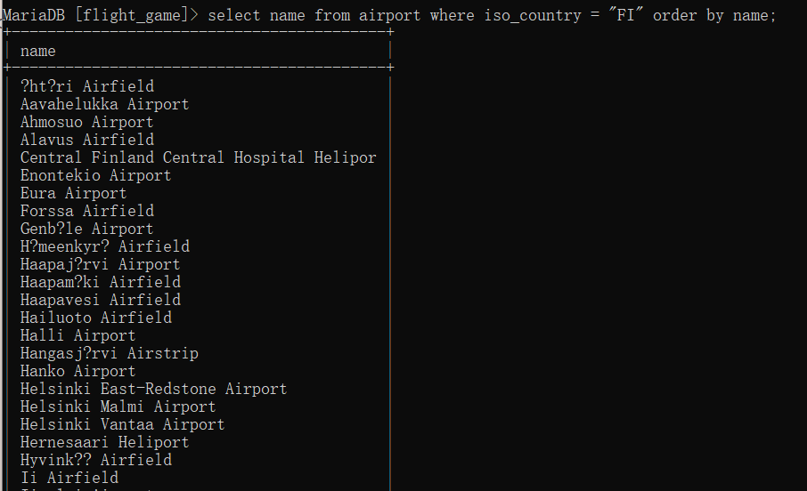
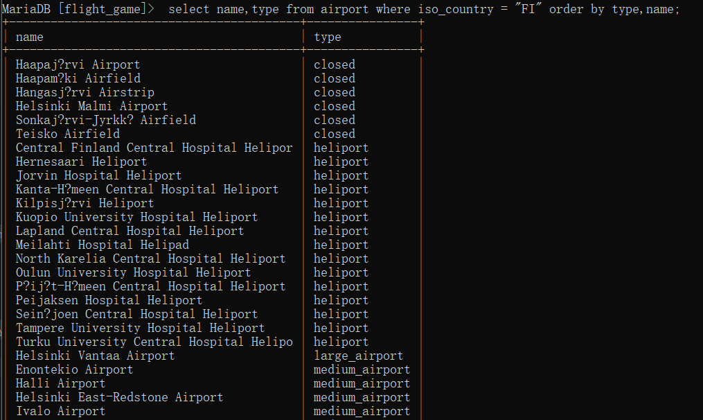
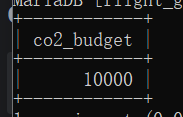
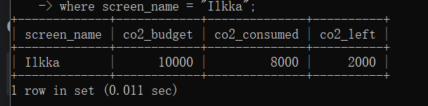

# Exercises 3
## question 1
```sql
select * from goal;
```

## question 2
```sql
select name from airport where iso_country = "FI";
```

## question 3
```sql
 select name from airport where iso_country = "FI" order by name;
```

## question 4
```sql
select name,type from airport where iso_country = "FI" order by type,name;
```

## question 5
```sql
select name from country where name like 'F%';
```

## question 6
```sql
select name from country where name like "%F%";
```

## question 7
```sql
select location from game where screen_name  = "Vesa"
```

## question 8
```sql
select co2_consumed from game where screen_name ="Ilkka";
```

## question 9
```sql
select distinct co2_budget from game;
```

## question 10
```sql
select screen_name ,co2_budget , co2_consumed,(@c02_left:=co2_budget - co2_consumed) as co2_left from game
where screen_name = "Ilkka";
```
