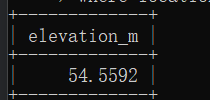

# Exercises 4
## question 1
```sql
SELECT country.name as "country name",airport.name as "airport name"
from airport,country
where airport.iso_country=country.iso_country and country.name="Iceland";
```

## question 2
```sql
SELECT airport.name as "airport name" FROM airport,country
WHERE airport.type = "large_airport" AND airport.iso_country=country.iso_country AND country.name="France";
```

## question 3
```sql
select country.name as country_name, airport.name as airport_name
from airport, country
where airport.iso_country = country.iso_country and country.continent = "AN";
```

## question 4
```sql
select elevation_ft
from airport, game
where location = ident and screen_name = "Heini";
```

## question 5  
```sql
select elevation_ft * 0.3048 as elevation_m
from airport,game
where location = ident and screen_name = "Heini";
```

## question 6
```sql
select airport.name as name 
from airport ,game
where airport.ident = game.location and screen_name = "Ilkka";
```

## question 7
```sql
select country.name as name 
from airport ,game,country
where airport.ident = game.location and airport.iso_country=country.iso_country and screen_name = "Ilkka";
```

## question 8
```sql
select goal.name from goal ,goal_reached,game
where goal.id=goal_reached.goal_id and game.id=goal_reached.game_id and screen_name = "Heini";
```

## question 9
```sql
select airport.name from goal ,goal_reached,game,airport
where goal.id=goal_reached.goal_id 
and game.id=goal_reached.game_id 
and game.location=airport.ident
and screen_name = "Ilkka"
and goal.name="CLOUDS";
```

## question 10
```sql
select country.name from goal ,goal_reached,game,airport,country
where goal.id=goal_reached.goal_id 
and game.id=goal_reached.game_id 
and game.location=airport.ident
and airport.iso_country = country.iso_country
and screen_name = "Ilkka"
and goal.name="CLOUDS";
```
