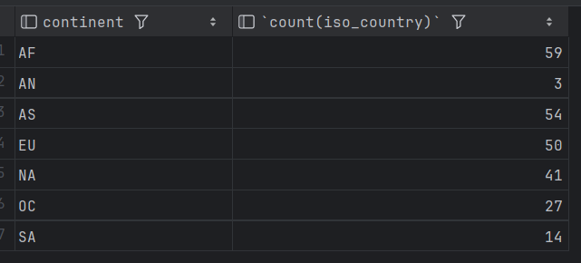
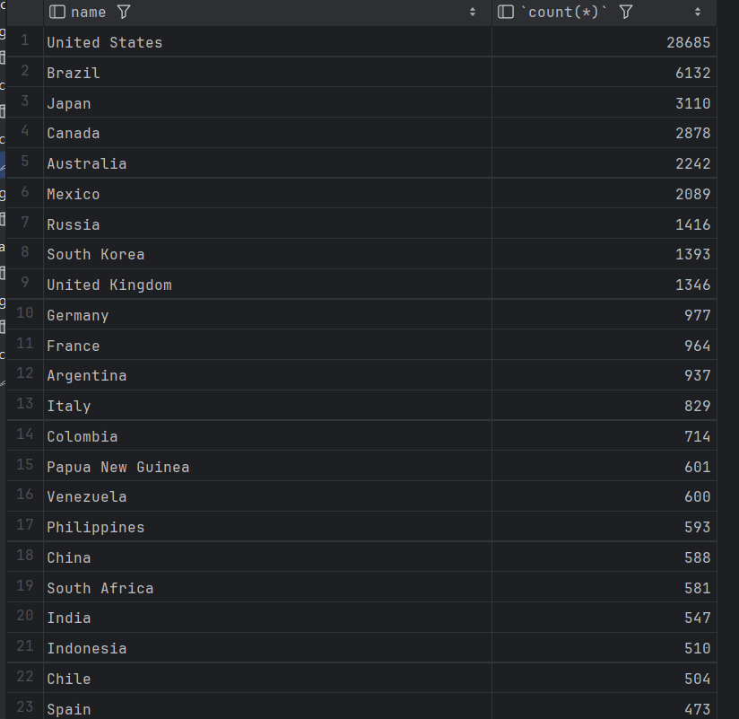
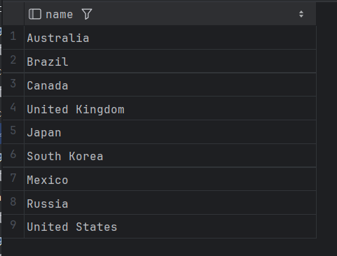

## question 1
```sql
SELECT max(airport.elevation_ft) as "max(elevation_ft)"
from airport;
```

## question 2  
```sql
SELECT continent,count(iso_country)
from country
group by continent;
```

## question 3
```sql
select screen_name, count(*)
from game, goal_reached
where id = game_id
group by screen_name;
```

## question 4
```sql
select screen_name
from game
where co2_consumed in(
select min(co2_consumed)
from game
);
```

## question 5
```sql
select country.name ,count(*)
from country,airport
where airport.iso_country=country.iso_country
group by airport.iso_country
order by count(*) desc
limit 50;
```

## question 6
```sql
select country.name
from country,airport
where airport.iso_country=country.iso_country
group by airport.iso_country
having count(*)>1000;
```

## question 7  
```sql
select name
from airport
where elevation_ft=(select max(elevation_ft) from airport);
```

## question 8
```sql
select country.name
from airport,country
where elevation_ft=(select max(elevation_ft) from airport)and airport.iso_country=country.iso_country;
```

## question 9
```sql
select count(*)
from game, goal_reached
where id = game_id and screen_name="Vesa"
group by screen_name;
```

## question 10
```sql
select name
from airport
where latitude_deg in(
select min(latitude_deg)
from airport
);
```
