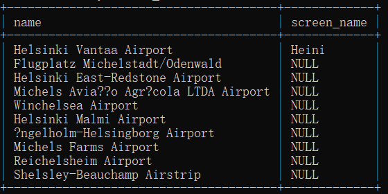

## question 1
```sql
select country.name as "country name", airport.name as "airport name"
from country inner join airport on airport.iso_country = country.iso_country
where country.name = "Finland" and scheduled_service = "yes";
```

## question 2
```sql
select game.screen_name,airport.name
from game  inner join airport on airport.ident=game.location;
```

## question 3
```sql
select game.screen_name , country.name
from airport inner join game on game.location=airport.ident
inner join country on airport.iso_country = country.iso_country;
```

## question4
```sql
select airport.name , game.screen_name
from airport
left join game on airport.ident = game.location
where airport.name like '%Hels%'
order by screen_name desc;
```

## question 5
```sql
select goal.name , game.screen_name
from goal
left join goal_reached on goal.id = goal_reached.goal_id
left join game on goal_reached.game_id = game.id;
```
