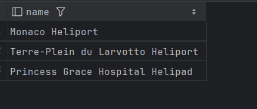
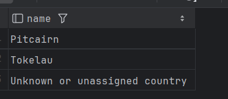
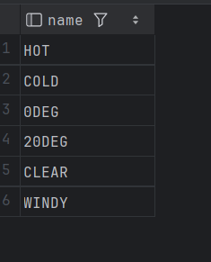

## question 1
```sql
SELECT name 
FROM airport inner join country on airport.iso_country=country.iso_country
where airport.name like "Satsuma%";
```

## question 2
```sql
select name from airport
where iso_country in (
    select iso_country
    from country
    where name = "Monaco"
    );
```

## question 3
```sql
SELECT game.screen_name
from game
where id in (
    select goal_reached.game_id
    from goal_reached
    where goal_reached.goal_id in (
        select id
        from goal
        where name = "CLOUDS"
        )
    );
```

## question 4  
```sql
SELECT name
from country
where iso_country not in (
    select iso_country from airport
    );
```

## question 5  
```sql
SELECT name
from goal
where id not in (
    select goal_id from goal_reached
    );
```
